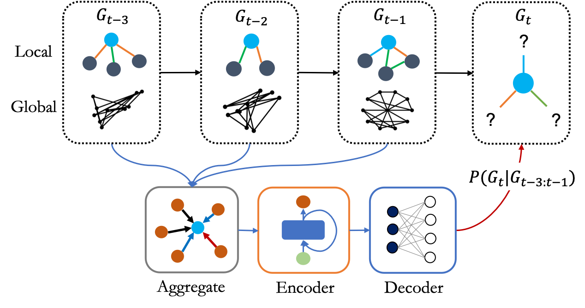

## PyTorch implementation of Recurrent Event Network (RE-Net)

Paper: [Recurrent Event Network: Autoregressive Structure Inference over Temporal Knowledge Graphs](https://arxiv.org/abs/1904.05530)

TL;DR: We propose an autoregressive model to infer graph structures at unobserved times on temporal knowledge graphs (*extrapolation* problem).

This repository contains the implementation of the RE-Net architectures described in the paper.

<p align="center"></p>

Knowledge graph reasoning is a critical task in natural language processing. The task becomes more challenging on temporal knowledge graphs, where each fact is associated with a timestamp. Most existing methods focus on reasoning at past timestamps, which are not able to predict facts happening in the future. This paper proposes Recurrent Event Network (RE-Net), a novel autoregressive architecture for predicting future interactions. The occurrence of a fact (event) is modeled as a probability distribution conditioned on temporal sequences of past knowledge graphs. Specifically, our RE-Net employs a recurrent event encoder to encode past facts, and uses a neighborhood aggregator to model the connection of facts at the same timestamp. Future facts can then be inferred in a sequential manner based on the two modules. We evaluate our proposed method via link prediction at future times on five public datasets. Through extensive experiments we demonstrate the strength of RE-Net, especially on multi-step inference over future time stamps, and achieve state-of-the-art performance on all five datasets.

If you make use of this code or the RE-Net algorithm in your work, please cite the following paper:

```bibtex
@inproceedings{jin2020Renet,
	title={Recurrent Event Network: Autoregressive Structure Inference over Temporal Knowledge Graphs},
	author={Jin, Woojeong and Qu, Meng and Jin, Xisen and Ren, Xiang},
	booktitle={EMNLP},
	year={2020}
}
```

## Quick Links
- [Installation](#Installation)
- [Train and Test](#Train-and-Test)
- [Related Work](#Related-Work)
- [Datasets](#Datasets)
- [Baselines](#Baselines)
<!-- - [Predictive Performances](#Predictive-performances) -->

## Installation
Run the following commands to create a conda environment (assume CUDA10.1):
```bash
conda create -n renet python=3.6 numpy
conda activate renet
pip install torch==1.6.0+cu101 torchvision==0.7.0+cu101 -f https://download.pytorch.org/whl/torch_stable.html
conda install -c dglteam "dgl-cuda10.1<0.5"
```

## Train and Test
In this code, RE-Net with RGCN aggregator is included. 
Before running, the user should preprocess datasets.

<!-- For attentive, mean, pooling aggregators (model 0,1,2)
```bash
cd data/DATA_NAME
python3 get_history.py
``` -->

<!-- For an RGCN aggregator (model 3) -->
```bash
cd data/DATA_NAME
python3 get_history_graph.py
```

We first pretrain the global model.
```bash
python3 pretrain.py -d DATA_NAME --gpu 0 --dropout 0.5 --n-hidden 200 --lr 1e-3 --max-epochs 20 --batch-size 1024
```

Then, train the model.
```bash
python3 train.py -d DATA_NAME --gpu 0 --dropout 0.5 --n-hidden 200 --lr 1e-3 --max-epochs 20 --batch-size 1024
```

We are ready to test!
```bash
python3 test.py -d DATA_NAME --gpu 0 --n-hidden 200
```

The default hyperparameters give the best performances.

<!-- ### Model variants -->

<!-- The user must specify a --model, the variants of which are described in detail in the paper:
- Attentive aggregator: --model 0
- Mean aggregator: --model 1
- Pooling aggregator: --model 2
- RGCN aggregator: --model 3 -->

## Related Work
Our work is on an *extrapolation* problem. There are only a few work on the problem.
Many studies on temporal knowledge graphs are focused on an *intrapolation* problem.
We organized the list of [related work](https://github.com/woojeongjin/dynamic-KG) such as Temporal Knowledge Graph Reasoning, Dynamic Graph Embedding, Knowledge Graph Embedding, and Static Graph Embedding.
<!-- There are related literatures: Temporal Knowledge Graph Embedding, Dynamic Graph Embedding, Knowledge Graph Embedding, Static Graph Embedding, etc.
We organized the list of [related work](https://github.com/woojeongjin/dynamic-KG).
 -->
## Datasets
There are four datasets: [ICEWS18](https://dataverse.harvard.edu/file.xhtml?persistentId=doi:10.7910/DVN/28075/Z1ZFYG&version=25.0), [ICEWS14](https://github.com/rstriv/Know-Evolve) (from Know-Evolve), [GDELT](https://blog.gdeltproject.org/gdelt-2-0-our-global-world-in-realtime/), [WIKI](https://www.wikidata.org/wiki/Wikidata:Main_Page), and [YAGO](https://www.mpi-inf.mpg.de/departments/databases-and-information-systems/research/yago-naga/yago/). 
These datasets are for the *extrapolation* problem. Times of test set should be larger than times of train and valid sets. (Times of valid set also should be larger than times of train set.)
Each data folder has 'stat.txt', 'train.txt', 'valid.txt', 'test.txt',and 'get_history_graph.py'.
- 'get_history_graph.py': This is for getting history and graph for the model.
- 'stat.txt': First value is the number of entities, and second value is the number of relations.
- 'train.txt', 'valid.txt', 'test.txt': First column is subject entities, second column is relations, and third column is object entities. The fourth column is time. The fifth column is for know-evolve's data format. It is ignored in RE-Net.

## Baselines
We use the following public codes for baselines and hyperparameters. We validated embedding sizes among presented values.

| Baselines   | Code                                                                      | Embedding size | Batch size |
|-------------|---------------------------------------------------------------------------|----------------|------------|
| TransE ([Bordes et al., 2013](https://papers.nips.cc/paper/5071-translating-embeddings-for-modeling-multi-relational-data))      | [Link](https://github.com/jimmywangheng/knowledge_representation_pytorch) | 100, 200       | 1024       |
| DistMult ([Yang et al., 2015](http://scottyih.org/files/ICLR2015_updated.pdf))   | [Link](https://github.com/jimmywangheng/knowledge_representation_pytorch) | 100, 200       | 1024       |
| ComplEx ([Trouillon et al., 2016](http://proceedings.mlr.press/v48/trouillon16.pdf))    | [Link](https://github.com/thunlp/OpenKE)                                  | 50, 100, 200   | 100        |
| RGCN ([Schlichtkrull et al., 2018](https://arxiv.org/pdf/1703.06103))      | [Link](https://github.com/dmlc/dgl/tree/master/examples/pytorch/rgcn)     | 200            | Default    |
| ConvE ([Dettmers et al., 2018](https://arxiv.org/pdf/1707.01476.pdf))      | [Link](https://github.com/TimDettmers/ConvE)                              | 200            | 128        |
| Know-Evolve ([Trivedi et al., 2017](https://arxiv.org/pdf/1705.05742)) | [Link](https://github.com/rstriv/Know-Evolve)                             | Default        | Default    |
| HyTE ([Dasgupta et al., 2018](http://talukdar.net/papers/emnlp2018_HyTE.pdf))        | [Link](https://github.com/malllabiisc/HyTE)                               | 128            | Default    |


We implemented TA-TransE, TA-DistMult, and TTransE. The user can run the baselines by the following command.

```bash
cd ./baselines
CUDA_VISIBLE_DEVICES=0 python3 TA-TransE.py -f 1 -d ICEWS18 -L 1 -bs 1024 -n 1000
```

The user can find implementations in the 'baselines' folder.

<!-- ## Predictive Performances
In the **ICEWS18** dataset, the results with **filtered** metrics:

| Method        | MRR   | Hits@1 | Hits@3 | Hits@10 |
|---------------|-------|--------|--------|---------|
| TransE        | 17.56 | 2.48   | 26.95  | 43.87   |
| ConvE         | 37.67 | 29.91  | 40.80  | 51.69   |
| TA-DistMult   | 28.53 | 20.30  | 31.57  | 44.96
| RE-Net (mean) | 42.38 | 35.80  | 44.99  | 54.90   |
| RE-Net (attn) | 41.46 | 34.67  | 44.19  | 54.44   |
| RE-Net (pool) | 41.35 | 34.53  | 44.05  | 54.35   |
| RE-Net (RGCN) | 43.20 | 36.63  | 45.58  | 55.91   |

In the **GDELT** dataset, the results with **filtered** metrics:

| Method        | MRR   | Hits@1 | Hits@3 | Hits@10 |
|---------------|-------|--------|--------|---------|
| TransE        | 16.05 | 0.00   | 26.10  | 42.29   |
| ConvE         | 36.99 | 28.05  | 40.32  | 50.44   |
| TA-DistMult   | 29.35 | 22.11  | 31.56  | 41.39   |
| RE-Net (mean) | 39.15 | 30.84  | 43.07  | 53.48   |
| RE-Net (attn) | 38.07 | 29.44  | 42.26  | 52.93   |
| RE-Net (pool) | 37.99 | 30.05  | 41.40  | 52.18   |
| RE-Net (RGCN) | 40.21 | 32.54  | 43.53  | 53.83   |

In the **WIKI** dataset, the results with **filtered** metrics:

| Method        | MRR   | Hits@1 | Hits@3 | Hits@10 |
|---------------|-------|--------|--------|---------|
| TransE        | 19.30 | 14.01  | 24.01  | 25.82   |
| ConvE         | 49.57 | 48.23  | 51.07  | 52.53   |
| TA-DistMult   | 48.09 | 46.01  | 49.51  | 51.70   |
| RE-Net (mean) | 48.30 | 45.86  | 49.36  | 53.03   |
| RE-Net (attn) | 51.72 | 50.60  | 52.12  | 53.72   |
| RE-Net (pool) | 45.15 | 41.41  | 46.98  | 52.57   |
| RE-Net (RGCN) | 50.47 | 49.80  | 52.03  | 53.16   |

In the **YAGO** dataset, the results with **filtered** metrics:

| Method        | MRR   | Hits@1 | Hits@3 | Hits@10 |
|---------------|-------|--------|--------|---------|
| TransE        | 34.78 | 20.27  | 47.23  | 53.35   |
| ConvE         | 64.32 | 63.79  | 65.97  | 67.60   |
| TA-DistMult   | 62.72 | 59.30  | 64.94  | 68.19   |
| RE-Net (mean) | 65.51 | 63.85  | 66.06  | 68.03   |
| RE-Net (attn) | 65.79 | 64.50  | 66.00  | 67.82   |
| RE-Net (pool) | 63.65 | 61.25  | 64.76  | 67.45   |
| RE-Net (RGCN) | 65.69 | 64.83  | 66.32  | 68.48   | -->
